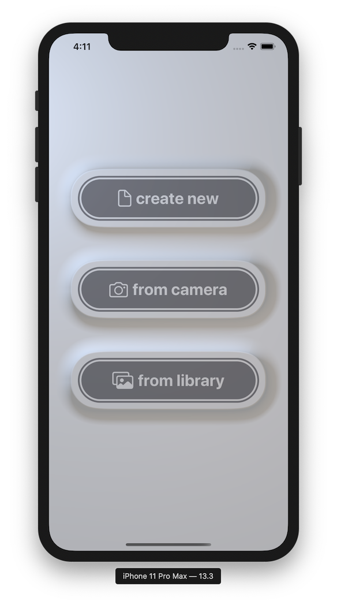

# SceneKit Neumorphism

An experiment to create **photorealistic dynamic neumorph SwiftUI components rendered with SceneKit.** SceneKit provides pretty advanced lighting (global illumination, HDR lighting, area shadows) solutions out of the box pretty suitable to beautifully render dynamically created meshes for UI controls.

## License

> Licensed under the [**MIT License**](https://en.wikipedia.org/wiki/MIT_License).
