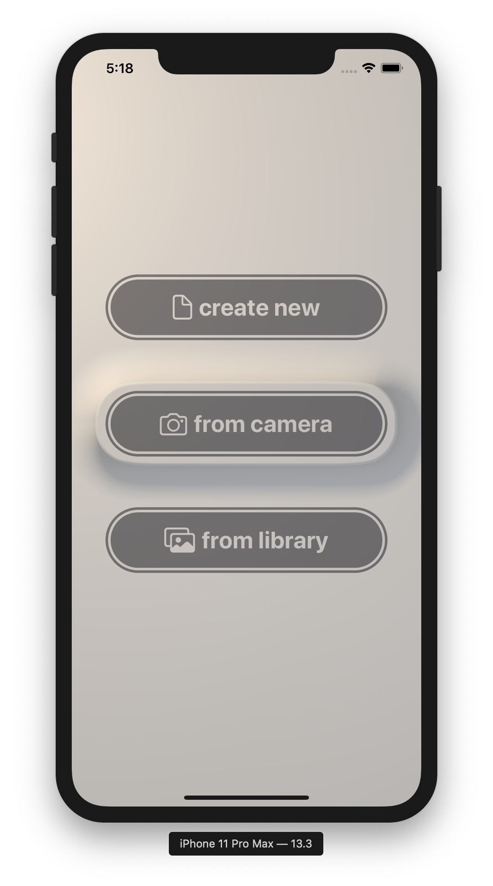

# SceneKit Neumorphism

An experiment to create **photorealistic neumorph SwiftUI compinents rendered with SceneKit.** SceneKit provides pretty advanced lighting (global illumination, HDR lighting, area shadows) solutions out of the box pretty suitable to beautifully render dynamically created meshes for UI controls. The project has just kicked off, expect the juice later this month. 

## License

> Licensed under the [**MIT License**](https://en.wikipedia.org/wiki/MIT_License).
